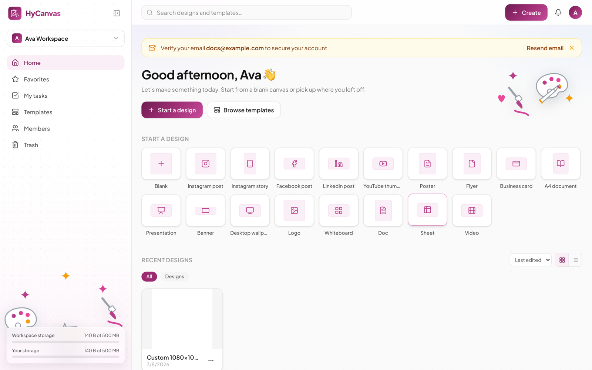
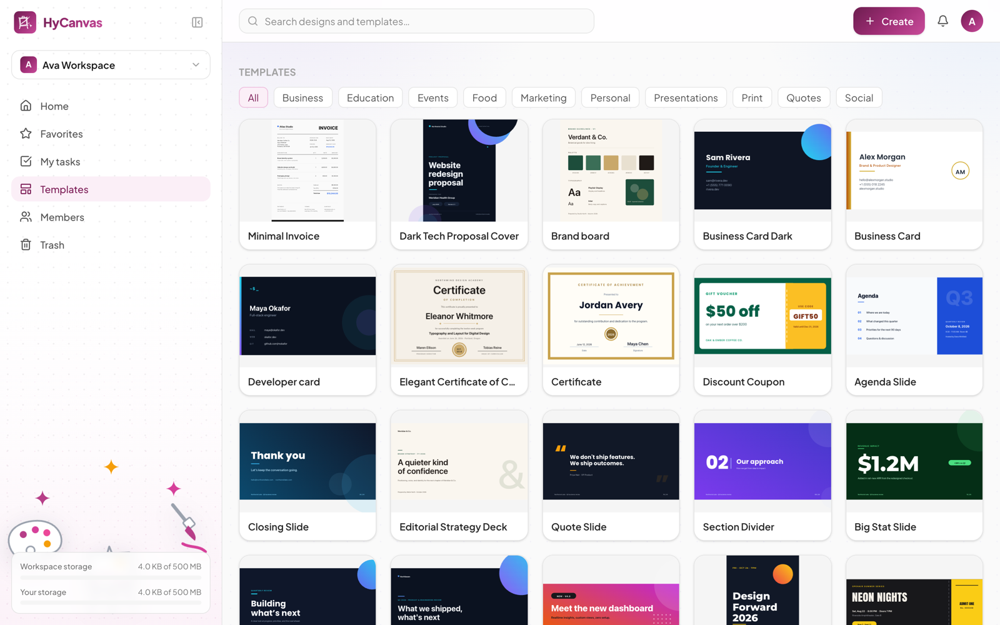
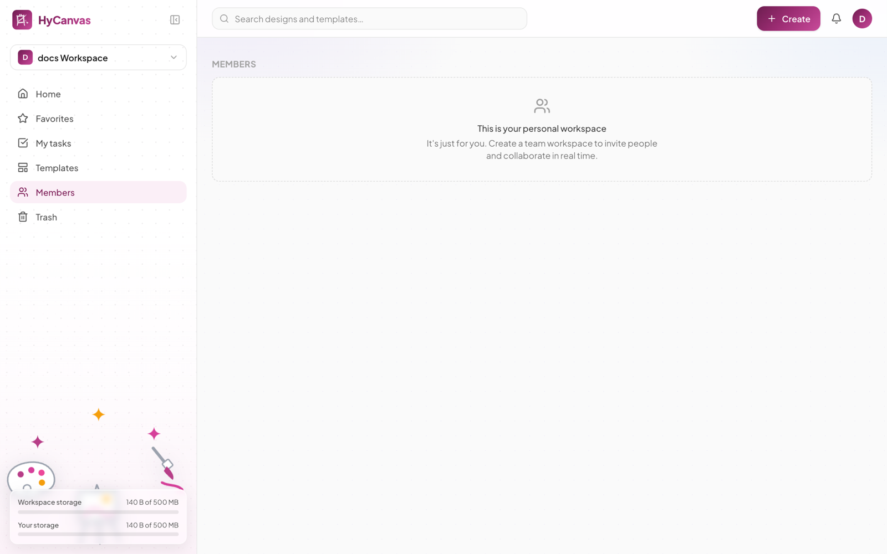
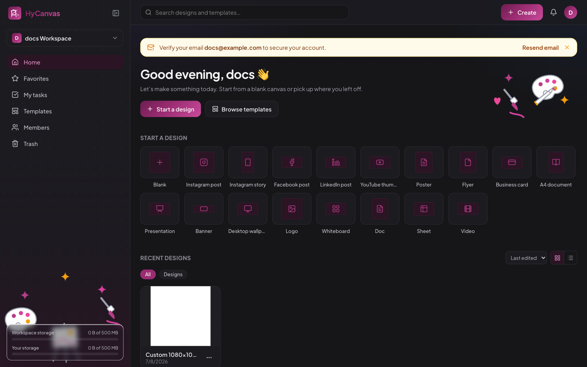
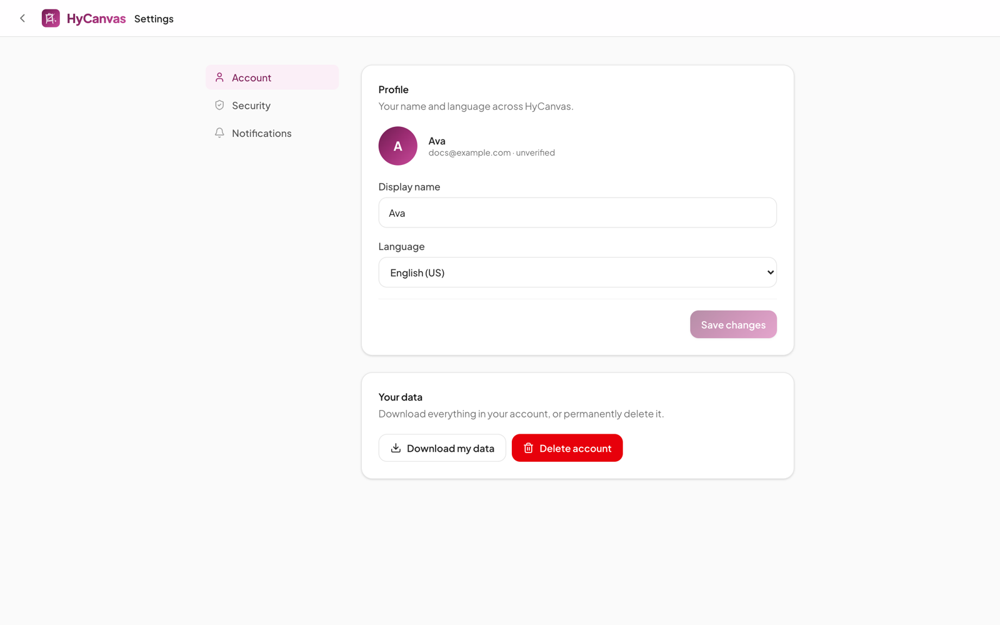
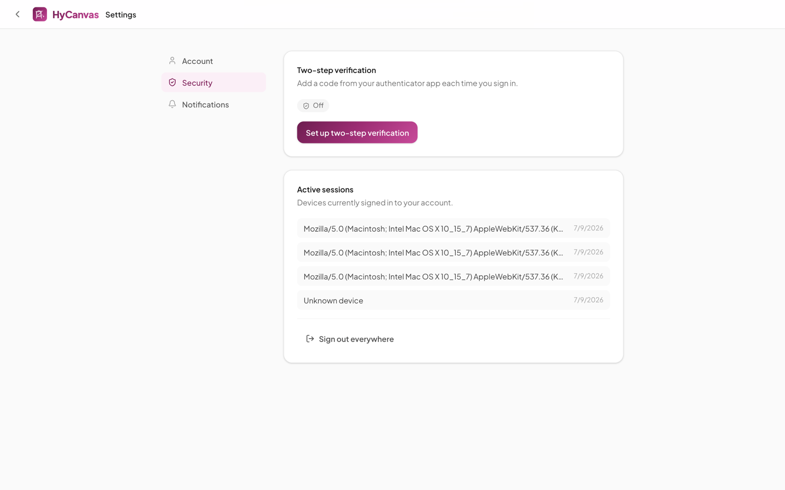

# The Dashboard

The dashboard is the home surface after signing in: it holds your designs, the template library, workspace membership, and your account settings.

## Layout

- **Top bar**: one search box across your designs and the template library, the **Create** button, notifications, and your account menu.
- **Left sidebar**: the workspace switcher, the section rail, and your storage meters. The panel icon next to the logo collapses the sidebar to icons; HyCanvas remembers your choice.
- **Main area**: quick-start format tiles (including **Import .hyc**, which opens a HyCanvas design file as a new design) and your recent designs, switchable between grid and list views and sortable by last edited.

## Workspaces

Every design lives in exactly one workspace. You get a personal workspace on signup and can create or join others; the switcher at the top of the sidebar moves between them. Workspace data is isolated: members of one workspace never see another workspace's designs, uploads, or brand kit.

## Sections

- **Home**: quick-start tiles and recent designs.
- **Favorites**: designs you starred.
- **My tasks**: items assigned to you (for example from design comments).
- **Templates**: the template library (below).
- **Members**: who is in the workspace, their roles, and invitations.
- **Trash**: deleted designs, restorable until emptied.

## Templates

The **Templates** section browses the library by category: business, education, events, food, marketing, personal, presentations, print, quotes, and social. Picking a template creates a new design from it in the current workspace. The presentations category leads with six presentation kits, sixteen-slide systems that carry every layout a deck needs in one style; a card's slide count marks a kit, and in the editor the same kit offers its slides one at a time. The same library is searchable from the top bar and reachable from the editor. Hovering a card offers a `.hyc` download of the template file, and **Import template** adds a `.hyc` file as a workspace template, so templates travel between instances as plain files.

Self-hosters can curate this library; see [Built-in Templates](../README.md#built-in-templates) in the root README.

## Storage meters

The bottom of the sidebar shows how much storage your uploads use:

- **Workspace storage**: everything uploaded into the current workspace, against the per-workspace limit (`ASSET_QUOTA_BYTES`).
- **Your storage**: everything you personally uploaded across all workspaces, against the per-user limit. This bar appears when the operator sets `USER_STORAGE_QUOTA_BYTES`.

A bar turns red as it approaches its limit. When a limit is reached, uploads are rejected with a message naming which limit was hit; deleting uploads frees space immediately.

## Members, roles, and sharing

**Members** lists everyone in the workspace with their role, and is where owners and admins invite people by email (invitees receive an email link; the invite is bound to that address) or remove them.

- **Roles**: Owner and Admin manage everything; Member can view, comment, edit, and share; Viewer can view and comment. Personal workspaces cannot be invited into.
- **Custom roles**: named capability sets (view, comment, edit, share, approve, manage roles, manage brand, delete) that admins define here and assign per design from the editor's Share dialog.

Sharing a single design with specific people or via link happens from the **Share** button inside the editor; see [the editor guide](editor.md#sharing-and-permissions).

## Import from Canva

**Import from Canva** (in Projects, next to Import files and Import folder) brings designs over from a Canva account, folder tree included, into the folder that is open.

**Set it up once per workspace (admin).** Canva only sends people back to addresses registered on an integration, so each danvas instance uses its own:

1. In Canva's developer portal (canva.com/developers/integrations), create a public integration. It can stay in draft; draft integrations work for your own team without Canva's review. The Canva account needs multi-factor authentication turned on.
2. In danvas, open **Members**: the **Canva import** section shows the **Redirect URL** and the **Scopes** (`folder:read design:content:read profile:read`). Add the redirect URL to the integration's authentication settings and enable those scopes. The redirect URL is built from the address you opened danvas with, so open danvas under its public address (behind a reverse proxy, the proxy must pass `X-Forwarded-Proto` and `X-Forwarded-Host`). Canva expects HTTPS addresses, except local ones for testing.
3. Paste the integration's **Client ID** and **Client secret** and save. The secret is stored encrypted (with `AI_SECRET`) and never shown again.

**Import (any member).** Choose **Import from Canva**, connect your own Canva account once, then tick what to bring over: single designs, whole folders (everything below them comes too), or everything. A ticked folder becomes a folder of the same name with its sub-folders mirrored; a ticked design goes straight into the open folder. Folders that already exist with the same name are reused.

- Each design arrives editable through PowerPoint export when Canva offers it for all pages. Otherwise it arrives as one image per page (looks exactly right, not editable); video designs arrive as still pages. The summary says how many came as images.
- Canva limits exports per person: about 20 per minute and 500 per day. The import paces itself, pauses for a minute when Canva asks it to slow down, and stops at the daily limit. Keep the tab open while it runs.
- Running the same import again skips what is already here, so an interrupted or day-limited import continues where it stopped. A design you deleted (moved to the trash) comes back on the next run.
- Disconnect your Canva account under Members, Canva import. Not imported: Canva uploads (your image and video library), brand templates, comments and version history.

## My tasks

Comments converted to tasks (from the editor's comment panel) land in **My tasks** when assigned to you, with status (Open, In progress, Done) and optional due dates.

## Dark mode

The interface follows your OS theme by default, and you can pin it light or dark from the avatar menu or Settings. Your designs, template previews, and present mode always keep their own colors.

## Account settings

The avatar menu in the top-right opens **Settings**.

- **Account**: display name, language, appearance, and your data. **Appearance** picks the interface theme (system, light, or dark; your designs are never restyled), also toggleable from the avatar menu on the dashboard. **Download my data** exports everything in your account; **Delete account** permanently removes it.
- **Security**: change your password, enroll two-step verification (a TOTP authenticator app), review and revoke active sessions, and link your organization's single sign-on (for example Google) to the account when the server has it configured.

- **Notifications**: per-type email and push preferences for mentions, replies, task assignments, shares, approval requests and decisions, workspace invites, and access requests.
